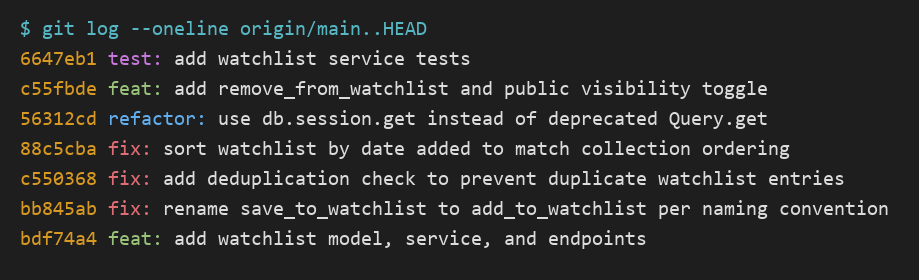

# PR Response Doc — CineLog Watchlist Feature

## AI Usage
I used an AI coding assistant in a few bounded ways, always verifying output against the actual
code:

- **Orientation.** Before reading the review comments, I had the assistant summarize
  `services/collection_service.py`, `models.py`, and `tests/test_collection.py` — specifically how
  `add_to_collection()` handles deduplication (query-first, raise `AlreadyInCollectionError`) and
  how the test fixtures are structured. I then confirmed each claim by reading the code, and built
  `add_to_watchlist()`'s dedup and `tests/test_watchlist.py` to mirror those verified patterns.
- **Bug catch during review.** While wiring up the sort-order test I discovered `get_watchlist()`
  dereferenced `entry.film` with no `WatchlistEntry`→`Film` relationship defined — a latent
  `AttributeError` on any non-empty watchlist. I verified it by running the test (it failed as
  predicted) and fixed it by mirroring `Film.collection_entries`.
- **Design stress-testing (Comments 4 and 5).** I wrote my positions first, then asked the
  assistant to argue the opposite side ("what would a careful reviewer say against keeping
  `public=True`? / against date-added sort?"). The strongest counter it raised on Comment 4 —
  that an opt-*out* toggle only protects users who know it exists, whereas privacy-by-default
  protects everyone — I did not have in my draft, so I added it explicitly as the acknowledged
  limitation of my position (the parenthetical note under Comment 4) rather than hiding it. On
  Comment 5 it mostly surfaced the alphabetical-lookup argument, which I had already addressed, so
  I kept my reasoning. The positions themselves (community-first default; date-added sort) are my
  own calls, grounded in CineLog being a "community film tracking app" with already-open read
  endpoints.
- **Hygiene.** I used the assistant to sanity-check that my final commit messages follow the
  Conventional Commits prefixes in `CONTRIBUTING.md`, then verified the log myself.

## Comment 1 — Rename
**What I did:**
Renamed `save_to_watchlist()` to `add_to_watchlist()` in `services/watchlist_service.py` to
match CineLog's `verb_to_noun` service-function convention (`add_to_collection`,
`remove_from_collection`, `get_collection`) documented in `CONTRIBUTING.md`. The verb the
codebase uses for this operation is `add`, not `save`.

I updated all call sites: the import and the call in `routes/watchlist/watchlist.py`. To find
them I ran a project-wide search (`grep -rn "save_to_watchlist" --include=*.py .`) rather than
relying on memory — that surfaced exactly three occurrences (the definition, the import, and the
call), and after the edits the same search returned nothing.

**How I verified:**
Re-ran `grep -rn "save_to_watchlist"` → no matches remain. Ran `pytest tests/ -v` → all tests
still pass, confirming no import broke.

## Comment 2 — Deduplication
**What I did:**
Added a duplicate check to `add_to_watchlist()` that mirrors `add_to_collection()` in
`services/collection_service.py`. Before, `add_to_watchlist()` created a new `WatchlistEntry`
unconditionally, so adding the same film twice silently produced two rows.

Following the collection pattern exactly, I:
1. Added an `AlreadyInWatchlistError` exception class (parallel to `AlreadyInCollectionError`).
2. Queried for an existing `(user_id, film_id)` entry and raised that error if one exists — the
   same "query first, then raise" shape `add_to_collection()` uses, placed after the
   `FilmNotFoundError` check and before creating the entry.
3. Added a `UniqueConstraint("user_id", "film_id", name="unique_user_film_watchlist")` to the
   `WatchlistEntry` model. `CollectionEntry` already has the equivalent constraint, so the
   service-level check and the DB-level constraint together enforce uniqueness (defense in
   depth) — matching how collection does it.
4. Wrapped the route call in `try/except` to surface `AlreadyInWatchlistError` as HTTP 409 and
   `FilmNotFoundError` as 404, exactly like the collection route. Without this the new exception
   would have propagated as a 500.

**How I verified:**
I read `add_to_collection()` first to confirm what a duplicate returns there (it raises
`AlreadyInCollectionError` rather than committing). Then I ran a throwaway script against an
in-memory DB: first add succeeds, second add raises `AlreadyInWatchlistError`, and the entry
count stays at 1. I also confirmed the nonexistent-film path still raises `FilmNotFoundError`.
Full `pytest tests/` still passes. A dedicated duplicate test is included in
`tests/test_watchlist.py` (see Comment 3).

## Comment 3 — Missing test
**What I did:**
Created `tests/test_watchlist.py`. I used `tests/test_collection.py` as the model — copying its
`app`, `sample_user`, and `sample_film` fixtures verbatim so the two suites stay consistent. The
required test, `test_add_to_watchlist_nonexistent_film_raises`, is the direct equivalent of
`test_add_to_collection_nonexistent_film_raises`: it passes a nonexistent film id and asserts
`FilmNotFoundError` is raised (not a raw DB error).

Since `add_to_watchlist()` is a new service function, `CONTRIBUTING.md` calls for three tests
(happy path, duplicate/conflict, nonexistent id), so I also added
`test_add_to_watchlist_creates_entry` and `test_add_to_watchlist_duplicate_raises`. The duplicate
test also serves as the committed regression test for the Comment 2 dedup work.

**How I verified:**
`pytest tests/test_watchlist.py -v` → all 3 pass. `pytest tests/` → all 7 pass (4 collection + 3
watchlist), confirming no cross-suite interference from shared fixture names.

## Comment 4 — Default visibility
**My position:**
Keep `public=True` as the default, and instead give callers a way to opt *out* (see the
visibility-toggle change below). I'd rather not flip the default to private.

**Reasoning:**
CineLog isn't a private note-taking app — the README's first line calls it "a community film
tracking app," and the whole point of the product is that users see each other's activity. The
existing read surface already reflects that: `GET /collection/<user_id>` and
`GET /watchlist/<user_id>` return a user's lists to anyone who has the user_id, with no auth and
no visibility filter. So the app's *current* posture is already open-by-default; a private-by-
default watchlist would actually be the odd one out, not the safe norm.

For a watchlist specifically, public-by-default is what makes the feature earn its place. A
watchlist is a signal of *intent* — "these are the films I'm planning to watch" — and that signal
is exactly what powers the community loop this app is built around: seeing what friends have
queued, comparing lists, discovering films through other people's watchlists. If watchlists
default to private, the social graph starts empty and the feature is effectively invisible until
every user manually opts in — which most never will. The default is where you encode the behavior
you want to be common, and for a community app the common case is sharing.

**Tradeoff acknowledged:**
The real cost is privacy surprise: a watchlist reveals intent, and a user who doesn't realize
their list is public could feel their taste/plans were exposed without consent — a legitimate
concern the reviewer is right to raise. I'm not dismissing it; I'm resolving it differently than
flipping the default. Two things make public-by-default defensible here rather than reckless:
(1) the data is low-sensitivity relative to, say, ratings or watch history — it's "films I want to
watch," which is close to the public self-presentation users come to a film community for; and
(2) the fix for the privacy case is a per-entry opt-out, not a global default flip. I added a
`public` parameter to the add endpoint (below) so a privacy-conscious caller can set
`public=false` at add time. If usage data later showed users are surprised by the default, the
cheapest correction is flipping one column default — but I'd want that driven by evidence, not
assumed up front at the expense of the feature's core value.

*(Note: the honest counter I'd flag to the reviewer is that an opt-out only protects users who
know the toggle exists; a truly privacy-first design would default private and let users opt in.
I'm betting on the product being explicitly community-oriented, but that's the bet, and it's worth
revisiting once there's a real UI and real users.)*

## Comment 5 — Sort order
**My position:**
I agree with the maintainer — switch `get_watchlist()` from alphabetical-by-title to date-added,
newest-first. I changed `order_by(Film.title.asc())` to
`order_by(WatchlistEntry.date_added.desc())`.

**Reasoning:**
The strongest reason is consistency, and it's specific to how CineLog is already built:
`get_collection()` returns newest-first (`CollectionEntry.date_added.desc()`), and the collection
route even documents itself as "sorted newest-first." The collection and the watchlist are the two
per-user list views in the app, rendered by parallel endpoints. Having one sort newest-first and
the other alphabetically means a user learns two different mental models for what are, from their
perspective, the same kind of screen. Newest-first everywhere is one rule to learn.

It also fits what a watchlist is *for*. A watchlist is forward-looking — it answers "what do I want
to watch next?" The most relevant entries are usually the ones you just added: you heard about a
film, added it, and want it near the top when you next open the list. Alphabetical order buries a
just-added film in the middle of the list purely because its title starts with "M," which has
nothing to do with why you're looking at the list.

**Engagement with reviewer's point:**
The maintainer preferred date-added but (in the comment) mostly asserted it as a preference; the
reason I'd add is the consistency-with-`get_collection()` argument above, which grounds it in this
codebase rather than taste. I did seriously consider keeping alphabetical, because it has one real
strength the maintainer's position glosses over: for a *long* watchlist, alphabetical is faster
when you're checking "is film X already on my list?" But that use case is better served two other
ways — the dedup check now prevents duplicate adds so "did I already add it?" matters less, and
`get_watchlist()` returns the entire list as JSON, so any client that needs title order (or search)
can sort client-side. Baking alphabetical into the server default would optimize the server for the
rarer "hunt for a known title" case at the cost of the common "what's new on my list" glance. If a
real need for title sorting shows up, the clean answer is an optional `?sort=title` query param
(noted as a possible follow-up), not making it the default. I added a regression test
(`test_get_watchlist_returns_newest_first`) that would fail under the old alphabetical sort.

## Comment 6 — Rebase
**What conflicted:**
While this PR was open, `main` merged a refactor ("refactor: migrate film IDs from integer to
UUID") that changed `Film.id` and `CollectionEntry.film_id` from `db.Integer` to `db.String(36)`.
My branch was cut from `main` *before* that refactor, so my `WatchlistEntry` model still declared:

```python
film_id = db.Column(db.Integer, db.ForeignKey("film.id"), nullable=False)
```

Running `git fetch origin` then `git rebase origin/main` replayed my commits onto the UUID version
of `main`. The single conflict was in `models.py`: my `WatchlistEntry` block (integer `film_id`,
foreign-keying `film.id`) versus main's now-UUID `Film.id`/`CollectionEntry`. A `db.Integer`
foreign key pointing at a `db.String(36)` primary key is a type mismatch, so this had to be
reconciled, not just accepted either side.

**How I resolved it:**
I edited `models.py` to keep my `WatchlistEntry` additions (the model, the `public` column, and the
`unique_user_film_watchlist` constraint) while adopting main's UUID type for the foreign key:

```python
film_id = db.Column(db.String(36), db.ForeignKey("film.id"), nullable=False)
```

This matches exactly how the refactor treated `CollectionEntry.film_id`. I then updated the
integer-era references that weren't in the conflict markers: the `film_id (int)` docstrings in
`services/watchlist_service.py` and the `{ "film_id": <int> }` example in the route became UUID.
The test fixtures already use `film.id` (which is now a UUID string), so no test data changed.
After staging `models.py` I ran `git rebase --continue`; the remaining commits applied without
further conflicts.

**How I verified no conflict remains:**
- `grep -rn '<<<<<<<\|=======\|>>>>>>>'` across the tree → no conflict markers.
- `grep` for `db.Integer`/`<int>` in the watchlist code → only `year` and `rating` (legitimately
  integers) remain; no integer `film_id`.
- `git log --oneline --merges origin/main..HEAD` → empty, i.e. no merge commits; the branch is a
  linear rebase on top of `origin/main`.
- `pytest tests/` → all pass, and a manual end-to-end run through the Flask test client
  (`add` → `view` → duplicate → nonexistent → `remove`) works with real UUID film ids.

Note: because I rebased onto the UUID `main` and reconstructed my history from there, the
`WatchlistEntry` model is expressed with a UUID `film_id` directly in the feature commit rather
than as a separate "integer → UUID" follow-up commit — the migration is folded into how the
feature now exists on top of the refactored `main`.

## Commit History

Rewritten to Conventional Commits, one logical change per commit, linear on top of `origin/main`
(no merge commits). See `git-log.png` for the screenshot.

```
test: add watchlist service tests
feat: add remove_from_watchlist and public visibility toggle
refactor: use db.session.get instead of deprecated Query.get
fix: sort watchlist by date added to match collection ordering
fix: add deduplication check to prevent duplicate watchlist entries
fix: rename save_to_watchlist to add_to_watchlist per naming convention
feat: add watchlist model, service, and endpoints
```
(plus `docs: add pr-response.md ...` on top, added last.)



---

## PR Description

### What this feature does
Adds a **watchlist** to CineLog — the list of films a user wants to watch (as opposed to the
collection, which is films they've already watched). Users can add a film to their watchlist,
remove one, and view the whole list (returned newest-added first). Each entry has a visibility
flag so a watchlist can be shared with the community or kept private. The feature parallels the
existing collection feature: a `WatchlistEntry` model, a `watchlist_service`, and a `/watchlist`
blueprint, with the same deduplication and error-handling conventions.

### Endpoints
| Method | Endpoint | Description |
|--------|----------|-------------|
| `GET` | `/watchlist/<user_id>` | Return the user's watchlist (newest added first) |
| `POST` | `/watchlist/<user_id>/add` | Add a film. Body: `{"film_id": "<uuid>", "public": true}` (`public` optional, default `true`) |
| `DELETE` | `/watchlist/<user_id>/remove` | Remove a film. Body: `{"film_id": "<uuid>"}` |

### Design decisions
1. **Default visibility (`public=True`).** New watchlist entries are public by default because
   CineLog is a community app and its read endpoints are already open by `user_id`. Rather than
   flip the default to private, I added a `public` parameter so privacy-conscious callers can
   opt out per entry. Full reasoning and the acknowledged tradeoff are under **Comment 4** above.
2. **Sort order (date-added, newest first).** `get_watchlist()` sorts by `date_added` descending
   to match `get_collection()`, giving users one consistent ordering across both list views.
   Reasoning and the alternative considered are under **Comment 5** above.

### How to manually test
```bash
python -m venv .venv && source .venv/Scripts/activate   # Windows Git Bash
pip install -r requirements.txt
pytest tests/ -v          # 11 tests should pass
python app.py             # serves on http://127.0.0.1:5000 (no frontend; use curl)
```
There's no seed data, so create a user and a film first (via `flask shell` or a short script),
then exercise the endpoints with their UUIDs:
```bash
# add a film to the watchlist (public by default)
curl -X POST http://127.0.0.1:5000/watchlist/<user_id>/add \
     -H "Content-Type: application/json" -d '{"film_id": "<film_uuid>"}'
# add privately
curl -X POST http://127.0.0.1:5000/watchlist/<user_id>/add \
     -H "Content-Type: application/json" -d '{"film_id": "<film_uuid>", "public": false}'
# adding the same film again → 409 (dedup)
# add an unknown film id → 404
# view the watchlist (newest added first)
curl http://127.0.0.1:5000/watchlist/<user_id>
# remove a film
curl -X DELETE http://127.0.0.1:5000/watchlist/<user_id>/remove \
     -H "Content-Type: application/json" -d '{"film_id": "<film_uuid>"}'
# removing it again → 404
```
I verified this exact flow end to end through the Flask test client against an in-memory database:
add → 201 (`public: true`), private add → `public: false`, duplicate → 409, unknown film → 404,
view → newest-first ordering, remove → 200, remove-again → 404.
